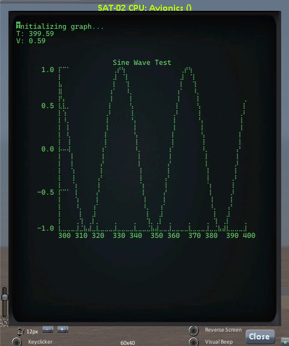
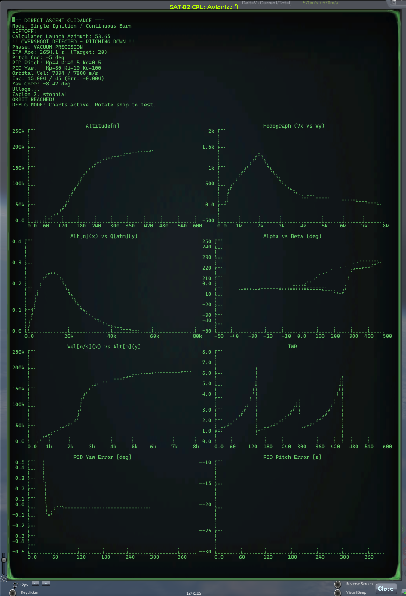
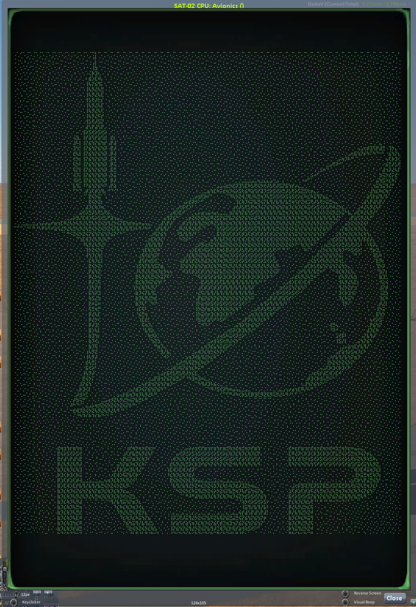

# kOS Chart Library

A library for drawing charts in the kOS terminal using Braille characters. It allows for a "virtual" resolution of 2x4 pixels per terminal character, enabling the creation of readable real-time charts.

## Features

*   **High Resolution:** Uses Unicode Braille characters to pack 8 pixels into a single terminal character (2x4 grid).
*   **Chart Drawing:** Easily create line or scatter plots.
*   **Automatic Axes:** Draws X and Y axes with labels and ticks.
*   **Paging:** Automatic handling of data exceeding the X-axis range (paging).
*   **Performance:** Optimized rendering (buffering, dirty flags).

## Installation

Copy the `canvas.ks` and `chart.ks` files to your ship's volume (e.g., `0:/` or `1:/`).

```kos
COPYPATH("0:/canvas.ks", "1:/").
COPYPATH("0:/chart.ks", "1:/").
```

## Usage

### 1. Import libraries

```kos
RUNPATH("1:/canvas.ks").
RUNPATH("1:/chart.ks").
```

### 2. Chart Initialization

The `Chart` function accepts the following parameters:
*   `width`, `height`: Dimensions in "pixels" (not characters!).
*   `originX`, `originY`: Top-left corner position in the terminal (in characters).
*   `minX`, `maxX`: X-axis range.
*   `minY`, `maxY`: Y-axis range.
*   `title`: Chart title.
*   `plotMode`: "LINE" (continuous line) or "POINT" (points).

```kos
// Example: 100x100 pixel chart
GLOBAL myChart IS Chart(
    100, 100,           // Dimensions (px)
    2, 2,               // Position (chars)
    0, 100,             // X Range
    -10, 10,            // Y Range
    "Test Chart",       // Title
    "LINE"              // Mode
).
```

### 3. Drawing Axes

```kos
// drawAxes(stepX, stepY, scaleX, scaleY)
myChart["drawAxes"](10, 2). 
```

### 4. Adding Data

In the main program loop, add points using the `plot(x, y)` method.

```kos
UNTIL FALSE {
    myChart["plot"](TIME:SECONDS, SHIP:ALTITUDE).
    WAIT 0.1.
}
```

## Example

A full example can be found in the `example.ks` file.

```kos
// Fragment of example.ks
SET TERMINAL:WIDTH TO 60.
SET TERMINAL:HEIGHT TO 40.
CLEARSCREEN.

RUNPATH("0:/canvas.ks").
RUNPATH("0:/chart.ks").

GLOBAL myChart IS Chart(100, 100, 5, 5, 0, 100, -1, 1, "Sine Wave", "LINE").
myChart["drawAxes"](10, 0.5). 
myChart["draw"](TRUE).

LOCAL t0 IS TIME:SECONDS.
UNTIL FALSE {
    LOCAL dt IS TIME:SECONDS - t0.
    myChart["plot"](dt, SIN(dt * 10)).
    WAIT 0.05.
}
```

## Gallery

### Sine Wave Chart


*Description: Example sine function chart generated by example.ks*

### 8 Charts

*Description:*

### Graphics


---
